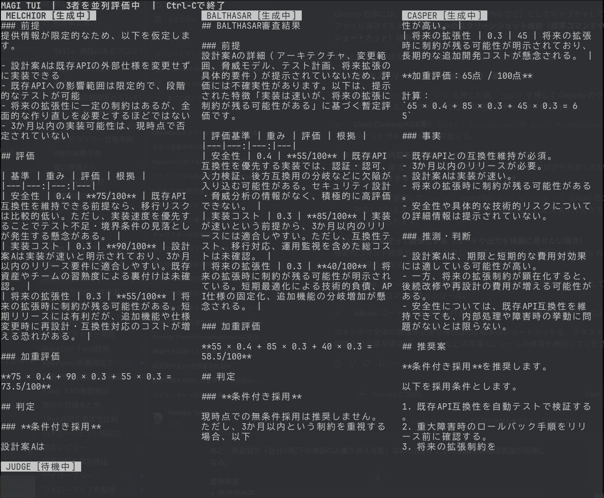

# MAGI

MAGIは、1つの意思決定を3つの独立した視点で評価し、統合判定を返すCLIツールです。

- MELCHIOR：技術、実装可能性、保守性
- BALTHASAR：リスク、失敗条件、運用負荷
- CASPER：利用者価値、期限、費用対効果
- JUDGE：3者の分析を比較した最終判定



## セットアップ

外部APIを利用する場合は、OpenAI APIキーを環境変数に設定します。

```bash
export OPENAI_API_KEY="your-api-key"
```

モデルは`MAGI_MODEL`で変更できます。未指定時は`gpt-5.4-mini`を使用します。

```bash
export MAGI_MODEL="gpt-5.4-mini"
```

APIキーはリポジトリや入力JSONに保存しないでください。

## 基本的な使い方

APIを呼び出さずに形式を確認する場合は、`--mock`を指定します。

```bash
python3 magi.py examples/decision.json --mock
```

通常実行では、MELCHIOR・BALTHASAR・CASPERの分析後にJUDGEが統合判定を行います。

```bash
python3 magi.py examples/decision.json
```

最終結果はJSONとして標準出力に出力されます。

## uvで実行する

依存関係を分離した一時環境で実行する場合は、`uvx`を使えます。

```bash
uvx --from . magi examples/decision.json --mock
```

ローカル開発では、`uv run`でも実行できます。

```bash
uv run magi examples/decision.json --mock
```

## 表示モード

生成中の回答をターミナルへ逐次表示するには、`--stream`を指定します。進捗は標準エラー出力、最終JSONは標準出力に分かれます。

```bash
python3 magi.py examples/decision.json --stream
```

人格ごとの回答をペインに分けて確認する場合は、`--tui`を指定します。

```bash
python3 magi.py examples/decision.json --tui
```

TUIの操作方法：

- `Tab` / `←` / `→`：ペインを切り替え
- `↑` / `↓` / `j` / `k`：スクロール
- `PageUp` / `PageDown`：ページ単位でスクロール
- `Home` / `End`：先頭・末尾へ移動
- `q` / `Esc`：終了

`--stream`と`--tui`は同時に指定できません。TUIは対話端末で使用してください。

## Codex連携

`magi-review`スキルを使うと、自然言語で指定した対象・criteria・制約・選択肢を判定依頼JSONに整理してMAGIを実行できます。

Codexをリポジトリのルートで起動し、依頼の先頭で`$magi-review`を指定します。

```text
$magi-review

この設計案を採用するか判断して。

criteria:
- 正確性: 0.5
- 実装コスト: 0.3
- 運用性: 0.2

制約:
- 既存APIの互換性を維持する

選択肢:
- 採用
- 条件付き採用
- 見送り
```

実APIを使う場合は、Codexを起動する環境に`OPENAI_API_KEY`を設定してください。

### スキルの配置

`magi.py --install`を実行すると、実行中の`magi.py`の絶対パスをスキルへ埋め込んで配置します。既定の配置先はユーザー共通の`~/.agents/skills/magi-review`です。

```bash
python3 magi.py --install
```

リポジトリ内だけで使う場合は、`--scope repo`を指定します。

```bash
python3 magi.py --install --scope repo
```

アンインストールする場合は、インストール時と同じ`--scope`を指定します。

```bash
python3 magi.py --uninstall
python3 magi.py --uninstall --scope repo
```

配置後、`$magi-review`でスキルを呼び出します。一覧に表示されない場合はCodexを再起動してください。

## 入力形式

```json
{
  "subject": "設計案Aを採用するか",
  "context": "比較に必要な背景情報",
  "criteria": [
    {"name": "安全性", "weight": 0.4},
    {"name": "実装コスト", "weight": 0.3},
    {"name": "拡張性", "weight": 0.3}
  ],
  "constraints": ["既存API互換を維持する"],
  "options": ["採用", "条件付き採用", "見送り"]
}
```

必須項目は`subject`と`criteria`です。`context`、`constraints`、`options`は任意です。criteriaの`weight`は、判定時の重要度を表します。

## 出力形式

結果JSONには次の項目が含まれます。

- `request`：入力された判定条件
- `analyses`：3者それぞれの分析
- `judgment`：JUDGEによる統合判定
